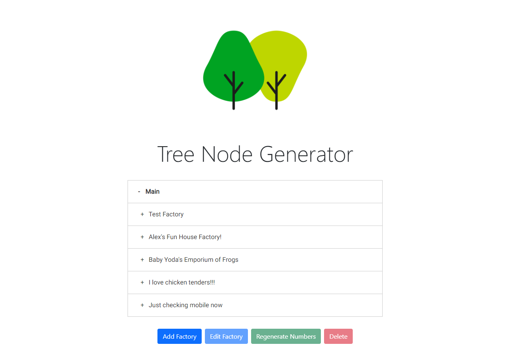
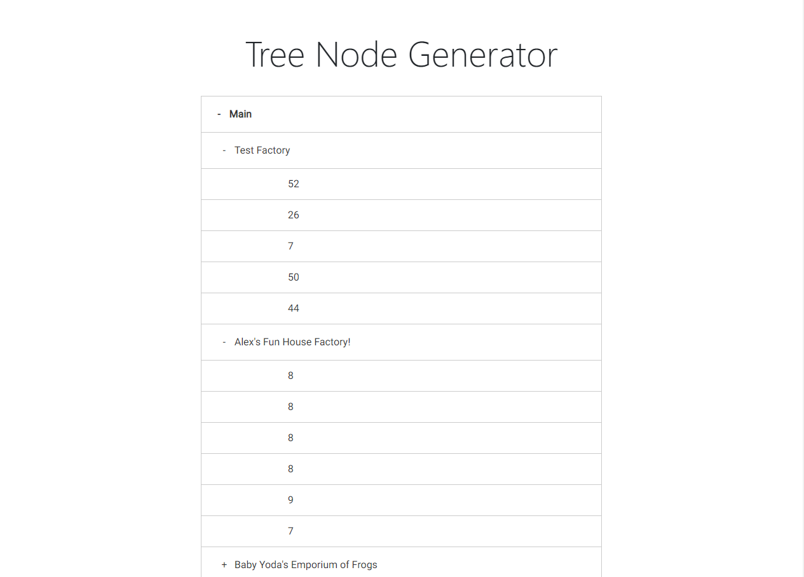
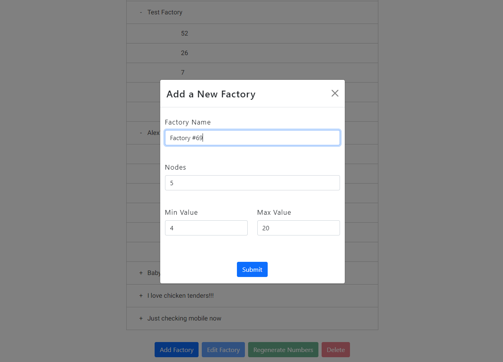

# Tree Node Application

## Table of Contents
- [Description](#Description)
- [Process](#Process)
- [Overview](#Overview)
- [Development Issues](#Issues)
- [License](#License)
- [Contributing](#Contributing)
- [Questions](#Questions)

## Description

This Tree Node Application lets users generate a "factory", with a name, set number of children nodes, and a minimum and max value for ranges of random numbers that are generated upon creation. Users can also regenerate the numbers within their selected factory (when highlighted), edit factory properties, and delete factories. No user authentication needed.

[App Link](https://stark-plains-19101.herokuapp.com/)

This app was created with ReactJs and React-Bootstrap for frontend, NodeJs/Express/MongoDB backend. The Tree Menu was a library from:
https://reactjsexample.com/a-simple-react-tree-menu-component/

### Process
This app was created as part of an assessment. I was given instructions that were a bit ambiguous and difficult to wrap my head around intially. After reviewing it over and over I was able to get a grasp of what was required of me. The first thing I normally do with any app is to plan everything out, from what tech I will use, what routes will be like for the back end, and what the front end may look like as a rough draft. The first task is to create the back end and functionality first, and then make the front end look a bit more presentable. Since time was of the essence, the biggest priority was functionality with a decently presentable UI. To do this, I used React-Bootstrap. My backend utilized MongoDB, which unlike MySQL, is a non-relational and non-table-based database. With time, again, being limited, I wanted to use tech that I was accustomed to, and the typical MERN stack application (MongoDB, Express, React, and NodeJS) is my go to for such projects. I tried to keep files organized well and keep the code as clean and as DRY as possible.

### Overview
The app itself is very simple in use. The user is allowed to create a factory with a name of their choice, along with selecting a number of child nodes that would be generated with a minimum and maximum range of values that a random number generator would fill in. When submitting a factory, a modal would appear on screen to allow the user to input what values they wanted. Selected nodes of the tree will highlight blue when selected, and if you do not have any selected, or have the main root selected, you cannot edit, remove or regenerate values (since, of course, nothing is selected).

The reason for being unable to edit the main root of the tree is because if that gets removed, the project would crumble. So I designed an interface that would not allow anyone to edit or remove the main root of the tree. For the form, I used a modal pop up component (courtesy of React-Bootstrap) that utilizes smooth and fluid transitions. The form modal itself is very simple and has a number of form validating functions checking to see things such as:

    - Did the user leave the factory name blank?
    - Did the user select a node amount that isn't between 1 and 15 (a requirement of the project)?
    - Did the user add a negative number for the min and max values?

Form validation is extremely important. If for some reason the form validation failed (somehow), the backend I created with MongoDB also has it's own validation that would reject any values that did not meet the criteria that I specified. Because of this, the app is very well protected with 2 forms of validation on both front and back end. There are other features I would like to add such as more animations, better looking icons for the tree menu, and having a factory's info appear in the form when selected for edits.

### Issues
As I said initially, one of the hard parts of this project was simply dissecting what exactly the requirements were asking of me, simply because the language was a bit ambiguous. As for coding challenges, I ran into a few.

My api routes were well defined and done correctly, however I noticed that my put route was editing the wrong factory. I was using Mongoose, and ORM for MongoDB, and using the findOneAndUpdate() method. After hours of attempts of switching parameters, console logging and going insane, I findally decided to change my route to use the findByIdAndUpdate() method. To my surprise, it worked! I'm not entirely sure why the other route was causing such an issue, but it seemed as though it was finding the first entry in my database and modifying that.

One other major issue I had was determining how to effectively use the tree menu library I imported. Rather than going with Material UI or Bootstrap for this, I went with a user created library because I thought it was very elegant, simple, and clean. The difficult part for implementing this was due to the api provided, which left me more confused than not at times. The tree needs to be supplied with TreeData as it's reffered to in the api, which can be an object or array. I created an array and called it TreeData, and placed it into the main root node. 

As for deployment, surprisingly, I had no issues. I used process.env to hide my mongoDB key and keep the it safe in a protected file that wouldn't be pushed to GitHub. This can likely be attributed to following instructions from Traversy Media on YouTube who seems to know about most things Web Development related...

## License                                   
[MIT](https://opensource.org/licenses/MIT)

## Contributing
This project was bootstrapped with [Create React App](https://github.com/facebook/create-react-app)
[React-Bootstrap](https://react-bootstrap.github.io/)
[Tree Menu Drop Down](https://reactjsexample.com/a-simple-react-tree-menu-component/)

## Questions
[GitHub: Fatmoogle](https://github.com/Fatmoogle)
[Email: alexvar93@gmail.com](alexvar93@gmail.com)

Feel free to reach out to me with any questions! Happy Hacking!